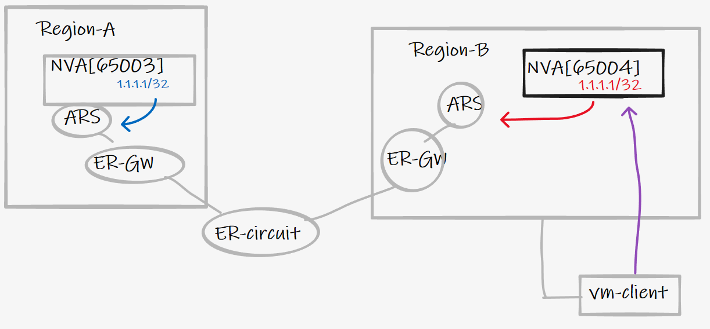

# Azure Anycast Inter-region routing

## Introduction

The purpose of this article is to highlight differences in how the following features can be used in relation to Anycast designs, when working with inter-region (Azure-to-Azure) failure scenarios:

- [Azure Route Server](https://docs.microsoft.com/en-us/azure/route-server/overview)
- [Azure Virtual WAN BGP Hub Peering (preview)](https://docs.microsoft.com/en-us/azure/virtual-wan/create-bgp-peering-hub-portal)

Both of these features are relatively new on the platform as of November 2021, and unlock the possibility for customers to inject (and receive) routes to/from the Azure SDN, via BGP.

> :bulb: Note, this article is narrowly focused on Anycast loopback reachability _between_ Azure regions (region to region), and not hybrid scenarios (onprem to Azure). The latter working with both products, detailed [here](https://github.com/adstuart/azure-routeserver-anycast) and [here](https://github.com/adstuart/azure-vwan-anycast).

> NB. An Anycast loopback could equally be an SDWAN network advertised from the NVA. I.e. the same logic discussed herein applies to any prefix advertised by BGP from the NVA.

## tl;dr 

We need to pay attention to transit routing scenarios when working with Azure Route Server and branch-to-branch setting, don't assume too much transit routing via ExpressRoute MSEE.

## High level scenario


- Region A NVA sends BGP loopback 1.1.1.1/32 to fabric via ARS or VWAN-BGP-Peering
- Region B NVA sends BGP loopback 1.1.1.1/32 to fabric via ARS or VWAN-BGP-Peering
- vm-client in region B accesses a service @1.1.1.1
  - under normal conditions this is served from region-B
  - what happens in failure scenarios?

## Azure Route Server


### Under normal BAU conditions 

- NVA[65004] advertises to ARS 1.1.1.1/32
- ARS injects this prefix in to VNet route table
- ARS also sends 1.1.1.1/32 to ER-circuit as branch-to-branch enabled on ARS
- vm-client accesses 1.1.1.1/32 with next-hop set as NVA[65004]



### Failure of [NVA65004]

- NVA[65004] fails
- Local ARS stops injecting 1.1.1.1/32 in to local VNet
- does vm-client have a backup route to 1.1.1.1/32?


The answer is unfortunately, no. Logic is configured within ARS<>ERGW interaction to stop programming of remote routes with AS-PATH [12076 12076 {private as}] to prevent transit routing of onprem-to-onprem via ExpressRoute hairpin. Therefore the Anycast design does not function as required and despite the 1.1.1.1/32 route existing in Region A, there is no reachability from vm-client.

> :warning: Region A VNet routes are learnt by Region B via ExpressRoute MSEE Hairpin, but transit routes injected via region A ARS, are not programmed by ER-GW.


> NB. **This only happens if Branch-to-branch is enabled on the Azure Route Server in Region-B**. This is somewhat of a moot point, as this is required to dynamically send the prefix to the other region via ER.

### Debug CLI output

```
#showing output from hub-b
adam@Azure:~$ az network vnet-gateway list-learned-routes -n hub-ergw -g lab-ars-charley -o table | egrep "65002|65003|65520"
#interhub routes from VWAN
10.5.250.0/24      EBgp      172.16.178.4   12076-12076-65520-65520        32769     172.16.178.4
10.5.250.0/24      EBgp      172.16.178.5   12076-12076-65520-65520        32769     172.16.178.5
10.6.0.0/16        EBgp      172.16.178.4   12076-12076-65520-65520        32769     172.16.178.4
10.6.0.0/16        EBgp      172.16.178.5   12076-12076-65520-65520        32769     172.16.178.5
10.31.0.0/24       EBgp      172.16.178.4   12076-12076-65520-65520        32769     172.16.178.4
10.31.0.0/24       EBgp      172.16.178.5   12076-12076-65520-65520        32769     172.16.178.5
172.16.100.0/24    EBgp      172.16.178.4   12076-12076-65520-65520        32769     172.16.178.4
172.16.100.0/24    EBgp      172.16.178.5   12076-12076-65520-65520        32769     172.16.178.5
#routes from onprem
192.168.2.0/24     EBgp      172.16.178.4   12076-65000-65001-65001-65002  32769     172.16.178.4 
192.168.2.0/24     EBgp      172.16.178.5   12076-65000-65001-65001-65002  32769     172.16.178.5
#routes from Hub-A
1.1.1.1/32         EBgp      172.16.178.4   12076-12076-65003              32769     172.16.178.4
1.1.1.1/32         EBgp      172.16.178.5   12076-12076-65003              32769     172.16.178.5
7.7.7.7/32         EBgp      172.16.178.4   12076-12076-65003              32769     172.16.178.4
7.7.7.7/32         EBgp      172.16.178.5   12076-12076-65003              32769     172.16.178.5
adam@Azure:~$ az network routeserver update --resource-group $rg --name $hubname-rs --allow-b2b-traffic true
"allowBranchToBranchTraffic": true,
adam@Azure:~$ az network vnet-gateway list-learned-routes -n hub-ergw -g lab-ars-charley -o table | egrep "65002|65003|65520"
192.168.2.0/24    EBgp      172.16.178.4   12076-65000-65001-65001-65002  32769     172.16.178.4
192.168.2.0/24    EBgp      172.16.178.5   12076-65000-65001-65001-65002  32769     172.16.178.5
192.168.2.0/24    IBgp      172.16.179.5   12076-65000-65001-65001-65002  32768     172.16.178.4
192.168.2.0/24    IBgp      172.16.179.4   12076-65000-65001-65001-65002  32768     172.16.178.4
```
### Bonus - same scenario as above, but with remote VWAN injected prefix

tl;dr - same beahaviour if prefix originates from VWAN remote network injection, which includes default routes injected by Routing Intent for example
i.e. Adding ARS + turning on B2B, to an existing VNet with ER-GW, will prevent it utilisation routes that are injected from remote VWAN Hubs. This can be an interesting design toggle/tool.


## Azure Virtual WAN Hub BGP peering


### Under normal BAU conditions 

- NVA[65004] advertises to virtual hub router 1.1.1.1/32
- VWAN injects this prefix in to VNet route table
- VWAN also sends 1.1.1.1/32 to ER-circuit as branch-to-branch enabled on VWAN hub standard
- vm-client accesses 1.1.1.1/32 via VWAN Hub


### Failure of [NVA65004]

- NVA[65004] fails
- Local VWAN hub stops injecting 1.1.1.1/32 in to local VNet
- does vm-client have a backup route to 1.1.1.1/32?


The answer is yes. The remote loopback in region A is learnt via the vwan hub2hub path. (NVA65003 > BGP peering > VWAN HUB A > H2H > VWAN HUB B). This transit via vwan hub2hub is allowed, and the Anycast address remains reachable, now served from Region-A.

### Debug output

Normal conditions, 9.9.9.9/32 served locally, note nexthop and as-path.


If NV65004 fails in region B, then recheck updated hub B route table, notice 9.9.9.9/32 is now served remotely via remote hub A.


